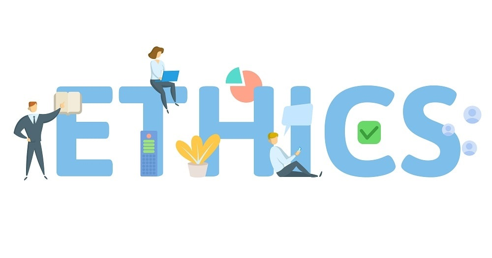

## Ethics in the Context of Software Engineering

As a software developer it is extremely important to have a devotion to delivering a high quality product for the consumer. And in order to create a quality product, being ethical in the creation of the product is of the utmost importance. With a sense of ethics and ethical standards the developer will able to understand the possible effect that their product could have. As the developer is the one that will be held responsible for the product's impact, whether it be good or bad. Thus, a software engineer needs ethics in order to create products which will benefit the consumer and a product which will not tarnish their reputation.

## Privacy

In our current technologically advanced society, the issue of privacy is a prevalent one with it seeming to become more scarce with each passing day. With the issue being especially prevalent in regards to software, with breaches of privacy being one of the major concerns of the avaerage consumer. With latest technological advancement, this is a topic that has to be discussed in order to ensure ethical standards are met and to secure the privacy of consumers. 

In the ACM Code of Ethics one of the general ethical principles is to respect the privacy of users. Though, this ethical principle was clearly broken by Google in 2010 with the privacy scandal Google had. This privacy scandal involved them collecting personal information from their users through their vehicles. And while there is a need to collect some personal information from users, the ACM Code of Ethics states that only a minimum amount of necessary personal data should be collected by the system, and the information collected should be clearly stated to users. Since Google did not notify users of the large amount of personal data that was collected by them, this act was clearly unethical.

It could also be argued that Google's StreetView feature is another example of ethic standards being broken, with many houses being in plain view for the world to see. The photos of houses on display could also be used by criminals in order to locate possible targets. With one of the general code of ethics being to avoid harm, this was clearly unethical. As with houses being on full display allowing many to view them to find vulnerabilities and weaknesses.

## The Stance

After going through the case study on privacy, the importance of clarity with users on the type of personal information collected has become extremely clear to me. I feel that users should know what personal information is being collected from them for the system, and users should be able to decide for themselves whether they wish to use the application or not. The consent of the user is extremely important in these situations, because if a user does not even know what information is being taken from them, how could that ever be ethical?
