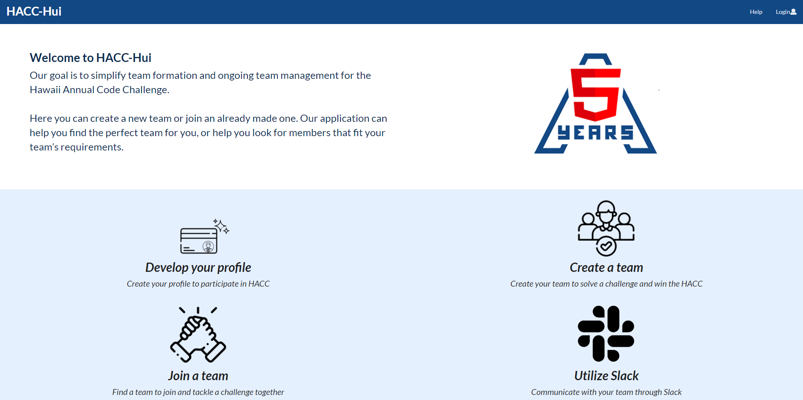
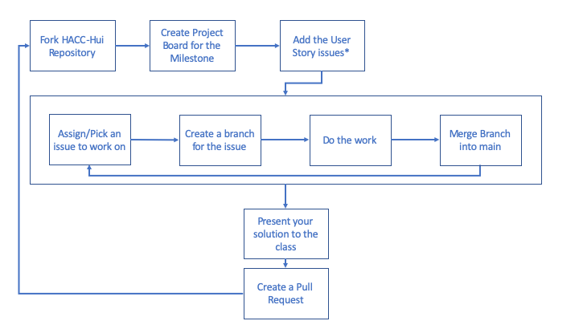
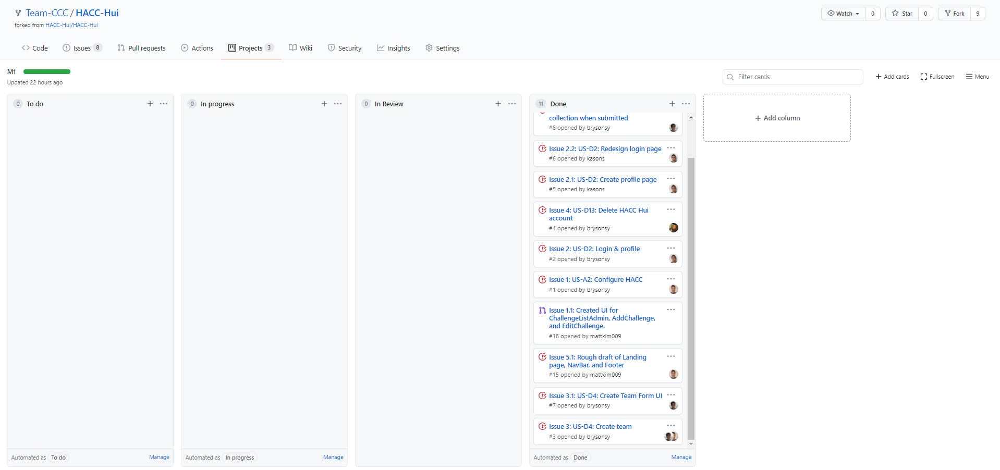
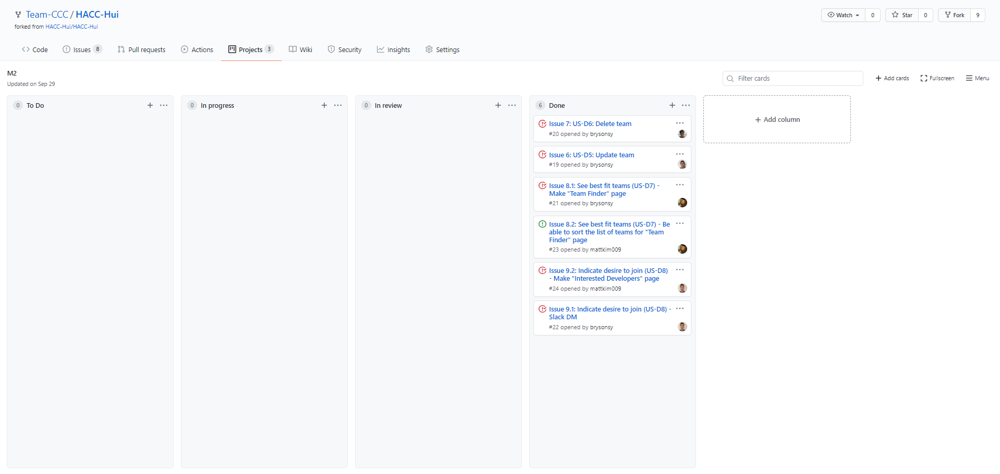
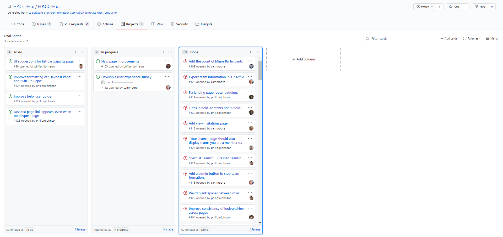

With over 200 developers attending the initial <a href="https://hacc.hawaii.gov/">Hawaii Annual Code Challenge</a> kick-off, there was a need for a better way to simplify the formation and management of teams between developers. Especially with the pandemic, which made it difficult for developers to meet and form teams in person. This all lead to the creation of <a href="https://hacchui.ics.hawaii.edu/#/">HACC-Hui</a>, a website to help HACC participants to gather members to form teams, which was created with React, Meteor, MongoDB, and Semantic-UI.

At the beginning of the semester we were initially split into groups of 4-5 people where each group would create a different version of the website that would fulfill the requirements for the milestone we were working on at the time. At the start of each milestone each team would fork the master HACC-Hui repo into their respective team's organization. Then each team would work on implementing the user stories from each <a href="https://hacc-hui.github.io/docs/requirements/milestone1/">milestone</a> and at the end of the milestone's deadline our professor chose the implementation of the milestone that would be added to the original master repository of HACC-Hui. Though this changed during the third milestone, where instead of each team working separately on the same milestone, we would all work on the master repository to implement the final features that were required.

## Milestone 1

For the <a href="https://hacc-hui.github.io/docs/requirements/milestone1">first milestone</a> our team decided to make a design mockup for website in order to have a cohesive user interface. After that we all assigned ourselves an issue that the milestone had. The one I was responsible for was US-D4: Create Team, which involved the creation of a team form where users could submit the information for a team they wished to create, and when the submit button was clicked this information would be added to the team collection. While creating the user interface for the add team page was fairly simple, working with the collections component of the page was a lot more difficult. The main issue was my unfamiliarity and inexperience when working with the collections. As I was not sure how to add the data that needed to be added like the challenges, skills, and tools of the team into the collection for that team. Though eventually I was able to get it to work after gaining a deeper understanding of how the collection worked.

Relevant Links:

<a href="https://github.com/Team-CCC/HACC-Hui/blob/issue-3/app/imports/ui/pages/CreateTeam.jsx">Create Team Page</a>

<a href="https://github.com/Team-CCC/HACC-Hui/projects/1">Milestone 1 Project Board</a>

## Milestone 2

For the <a href="https://hacc-hui.github.io/docs/requirements/milestone2">second milestone</a> our team once again split up the different issues, with one of the issues of the milestone going to one person. This time I was responsible for US-D6: Delete team, which involved creating a way for a team owner to delete their team from the site. Though since this issue was relatively simple compared to other issues in this milestone I also tried to help out where I could on other issues like US-D7: See bestfit teams and US-D8: Indicate desire to join. As most of the time we were able to find solutions to our issues by working together and bouncing ideas off one another. Though I still had some difficulty with the issue as I still didn't have a huge amount of experience with the methods for each collection. I also was having a bit of trouble making it so that only the owner of the team could delete it, though eventually I was able to work it out with my fellow team members.

Relevant Links: 

<a href="https://github.com/Team-CCC/HACC-Hui/blob/issue-07/app/imports/ui/components/developer/ListTeamExampleWidget.jsx">Delete Team Functionality on List Team Page</a>

<a href="https://github.com/Team-CCC/HACC-Hui/projects/2">Milestone 2 Project Board</a>

## Final Sprint

During the <a href="https://hacc-hui.github.io/docs/requirements/milestone3">third milestone</a> it was decided that we would all work on the master repository of HACC-Hui as one group. During the final sprint I worked on minor user interface changes like simplifying the navbar labels which involved changing the navbar labels to be shorter due to issues that the longer navbar labels caused on the mobile version of the site, as well as updating the create team widget to fit the color theme of the site which was as simple as changing the color of the team creation form. I also worked on another issue with a fellow student to create an admin page for viewing teams. This would be a page where admins of HACC-Hui could see if a team was compliant, which was true if all team members had signed the agreement for HACC. Though the user interface for the admin page was easy to figure out, we struggled to find a way to check if all the team members were compliant or not. Though eventually we were able to do this by using an underscore function that would go through the team members and check if the compliant value in the collection was false or not.

Relevant Links:

<a href="https://github.com/HACC-Hui/HACC-Hui/blob/issue-102/app/imports/ui/components/NavBar.jsx">Simplified Navbar Labels</a>

<a href="https://github.com/HACC-Hui/HACC-Hui/blob/issue-28/app/imports/ui/pages/participant/TeamCreation.jsx">Create Team Widget Updated to follow the theme</a>

<a href="https://github.com/HACC-Hui/HACC-Hui/blob/issue-41/app/imports/ui/components/administrator/ViewTeamExampleWidget.jsx">Admin Page for Viewing Teams</a>

<a href="https://github.com/HACC-Hui/HACC-Hui/projects/1">Final Sprint Project Board</a>

## The Team Experience

At the beginning of the class we were split into teams and my team, Team CCC, consisted of myself, Matthew Kim, Kason Shiroma, and Moseli Motsoehli. When each milestone came around we would discuss with each other and decide which issues we would want to work on. And for issues that were closely linked to one another, like with the participant finder needing to work for the team finder, we would coordinate with each other, mostly through discord. I felt this system worked well for us, as we would be able to choose issues that we were interested in to work on, and the work would be mostly evenly split most of the time, unless some issues contained more than others in that milestone. And if that was the case then we'd do our best to help each other and work between issues.
