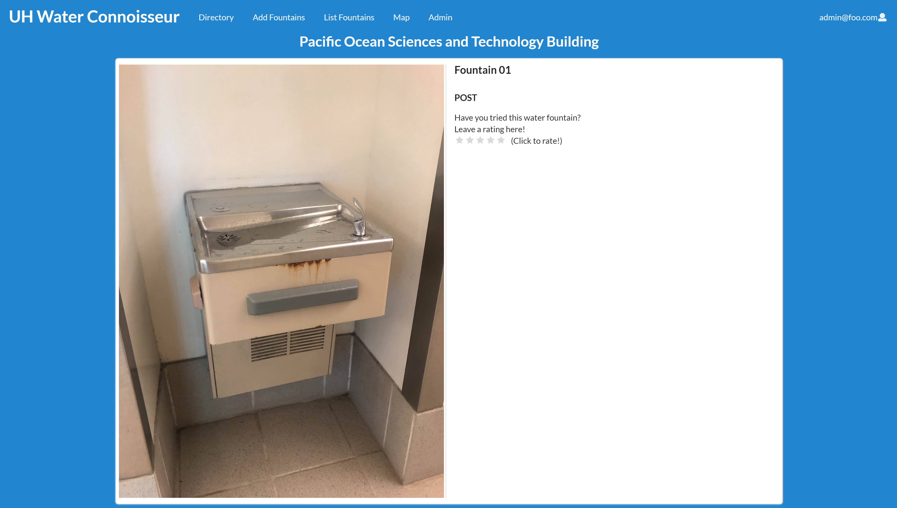

For our final project in ICS 314 I developed a website called UH Water Connoisseur with my group members Sean Sumida, Gunwook Baik, Jake Castillo, and Sheena Torres. UH Water Fountains is a web application designed so UH Manoa students will be able to rate the various water fountains on campus. After creating an account and logging into the application, users will be able to review a water fountain from the list that is avaliable or they can submit a fountain to be added to the already existing list. The fountain will then be reviewed by the admins of the application who can accept or deny the addition of the fountain. With water being one of the most important resources for our survival this app can allow students without their own water bottles to find the best water fountains for them on campus.

My contribution to the project was the creation of the rating system and the directory page. Though, I also tried to help out on any other issues that my group members were having trouble with. The directory page acted as a short explantion of features for the application, with it being the first page users see after logging in. It provided direct links to the most important features and offered explanations for each of them, allowing users to gain an understanding of the application and the features that it offered. The rating system was created so users could rate any fountain on the current list and saving it to their personal accounts so they could always see and remember what they rated a certain fountain. 

Through this project I have gained a significant amount of insight to collaboration with multiple group members and the project management skills that are required to successfully create a group application. The project also helped my skills when it came to UI Frameworks, especially with Semantic UI. Though the insight that I gained about collaborative programming is something that I will definitely keep throughout my journey in computer science. As we had to deal with problematic issues that would appear with conflicting code as we uploaded our progress to the master branch of our github. It was an incredible learning experience with how to effectively program an application with others and making effective progress while doing so. 

Here is the [UH Water Connoisseur Home Page](https://uh-waterfountain.github.io/) and here is the link the the [UH Water Connoisseur Source Code](https://github.com/uh-waterfountain/uh-waterfountain).
