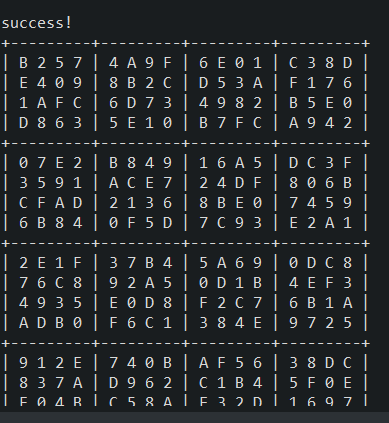

The hexadecimal sudoku solver shown here was a assignment from my ICS 211 class. This class dealt with implementing data structures in Java. For this assignment I had to use recursive algorithms which had just been introduced to us, and was personally one of the hardest projects given to us in the class.

For this project, I was tasked with creating a Java program which would recursively solve a hexadecimal sudoku puzzle. The puzzle had to be 16 by 16 in size and the program would fill all missing spaces with hexadecimal values that would lead to the sudoku puzzle being correct. When the puzzle was completed the program would output the sudoku puzzle it was tasked with solving and its solution. 

The program would solve the puzzle by scanning through a row and if an empty space was found. Once an empty space is found the program would then insert a valid number into the space and continue. If the program reaches an empty space where a valid value can not be found, the program would then backtrack and try to change a previous value that was entered until a valid value can be found for the empty space.

You can see my source code for this project [here](https://github.com/brysonsy/hexadecimal-sudoku-solver).

